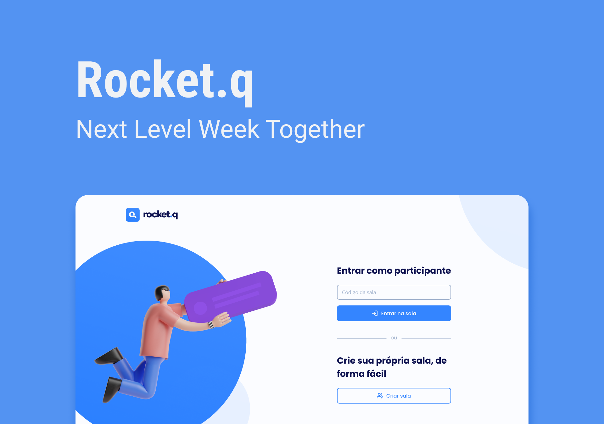

<h1 align="center"></h1>

Aplicação desenvolvida em evento promovido pela Rocketseat para ensino de tecnologias WEB e Mobile.

🔗 <a href="https://github.com/johnwilker/rocketq">Clique aqui para acessar o projeto no github</a>

  <a href="#-tecnologias">Tecnologias</a>&nbsp;&nbsp;&nbsp;|&nbsp;&nbsp;&nbsp;
  <a href="#-projeto">Projeto</a>&nbsp;&nbsp;&nbsp;|&nbsp;&nbsp;&nbsp;
  <a href="#-layout">Layout</a>&nbsp;&nbsp;&nbsp;|&nbsp;&nbsp;&nbsp;
  <a href="#memo-licença">Licença</a>

  

 

  

## 🚀 Tecnologias

Esse projeto foi desenvolvido com as seguintes tecnologias:

- HTML
- CSS
- [JavaScript](https://www.javascript.com/)
- [NodeJS](https://nodejs.org/en/)
- [EJS](https://ejs.co/)
- [Express](https://expressjs.com/)
- [SQLite](https://www.sqlite.org/index.html)

## 💻 Projeto

O NLW Rocket Q é uma aplicação desenvolvida com o intuito de perguntas e respostas anônimas, os usuários não precisam se cadastrar para enviar perguntas. Para acessar uma sala basta entrar com um código único que foi previamente compartilhado. A página de perguntas recebidas pelo criador da sala conta com as opções de marcar como lida e também de excluir perguntas.

## 🔖 Layout

Você pode visualizar o layout do projeto através [DESSE LINK](https://www.figma.com/file/In6fYhWH7PHHin4pe39T4F/Bol%C3%A3o-da-Copa?node-id=0%3A1&t=iyliObn1e1y9KUMz-1). É necessário ter conta no [Figma](https://figma.com) para acessá-lo.

## :memo: Licença

Esse projeto está sob a licença MIT.

---

Feito com ♥ by John :wave: [Participe da comunidade Rocketseat!](https://discord.gg/rocketseat)